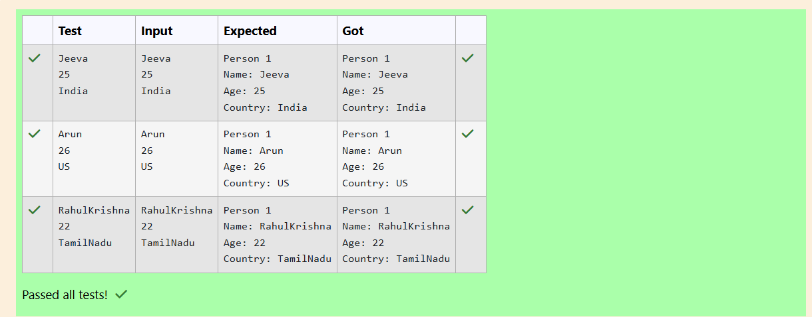

# Ex.No:2(C) ACCESS SPECIFIERS

## QUESTION:
Write a Java program to create a class called Person with private instance variables name, age. and country. Provide public getter and setter methods to access and modify these variables.

## AIM:
To create a Java program using encapsulation by declaring private variables and accessing them using getter and setter methods to store and display a person's details.

## ALGORITHM :
1.Start the program.

2.Create a class Person with private variables name, age, and country.

3.Create getter and setter methods for each variable.

4.In the main method, create a Scanner object to read input.

5.Read the person's name, age, and country from the user.

6.Create a Person object and set the values using setter methods.

7.Retrieve the values using getter methods and display the person's details.


## PROGRAM:
 ```
/*
Program to implement a Access Specifiers using Java
Developed by: Raha Priya Dharshini M
RegisterNumber: 212224240124
import java.util.*;

public class Person
{
        private String name;
        private int age;
        private String country;
        
        public String getName()
        {
            return name;
        }
        public void setName(String name)
        {
            this.name=name;
        }
        public int getAge()
        {
            return age;
        }
        public void setAge(int age)
        {
            this.age=age;
        }
        public String getCountry()
        {
            return country;
        }
        public void setCountry(String country)
        {
            this.country=country;
        }


    public static void main(String[] args)
    {
        Scanner sc=new Scanner(System.in);
        String name=sc.nextLine();
        int age=sc.nextInt();
        sc.nextLine();
        String country=sc.nextLine();
        Person  obj=new Person();
        obj.setName(name);
        obj.setAge(age);
        obj.setCountry(country);
        System.out.println("Person 1");
        System.out.println("Name: "+obj.getName());
        System.out.println("Age: "+obj.getAge());
        System.out.println("Country: "+obj.getCountry());
    }
}
*/
```

## SOURCE CODE:


## OUTPUT:




## RESULT:
The program successfully stores the name, age, and country of a person using encapsulation (getter and setter methods) and displays the details.
