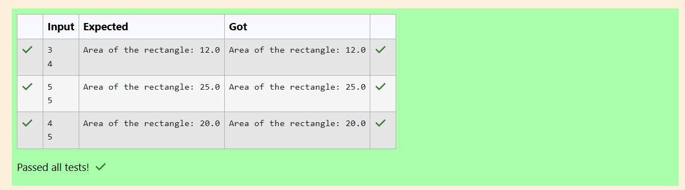

# Ex.No:2(D) VARIABLE SCOPE AND CONSTRUCTOR

## QUESTION:
Write a class Rectangle using parameterized constructor and calculate area.

## AIM:
To create a Java program that calculates and displays the area of a rectangle using a constructor.

## ALGORITHM :
1.Start the program.

2.Create a class rectangle with a constructor that accepts length and breadth.

3.Inside the constructor, calculate the area using length * breadth.

4.Print the area using printf.

5.In the main method, create a Scanner object to read input.

6.Read the values of length and breadth.

7.Create an object of class rectangle which automatically calls the constructor and prints the area.	


## PROGRAM:
 ```
/*
Program to implement a Variable scope and Constructor using Java
Developed by: Raha Priya Dharshini M
RegisterNumber: 212224240124
import java.util.*;
class rectangle
{
    rectangle(int length,int breadth)
    {
        System.out.printf("Area of the rectangle: %.1f", (length*breadth*1.0));
    }
}
class prog
{
    

    public static void main(String[] args)
    {
        Scanner sc=new Scanner(System.in);
       
        int length=sc.nextInt();
        int breadth=sc.nextInt();
        rectangle obj=new rectangle(length,breadth);
        
       
        
    }
    
}

*/
```


## OUTPUT:



## RESULT:
The program successfully calculates and displays the area of the rectangle using a constructor.
